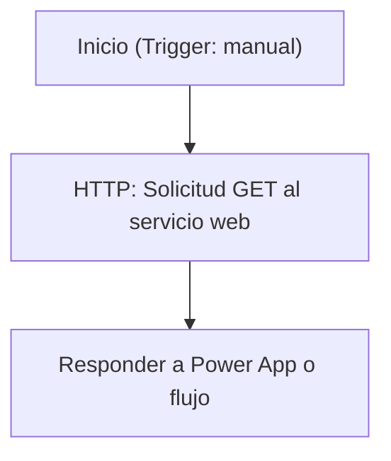

# Especificación Técnica de Arquitectura

## 1. Resumen Ejecutivo

La solución "QR Code Generator" desarrollada por DBD Technologies tiene como objetivo principal permitir la generación de códigos QR a partir de texto proporcionado por el usuario. La solución consta de un flujo de Power Automate que interactúa con un servicio web externo para generar el código QR y una aplicación Canvas que proporciona una interfaz de usuario para capturar el texto y mostrar el código QR generado. 

El flujo de Power Automate, denominado "QR Request", recibe el texto desde la aplicación Canvas, lo envía a un servicio web externo para la generación del código QR y devuelve el resultado a la aplicación. La aplicación Canvas, llamada "QR Code Generator", incluye una pantalla principal con un campo de entrada de texto, un botón para generar el código QR y un área para mostrar el resultado. Esta solución está diseñada para ser utilizada en dispositivos móviles y tabletas, con soporte tanto para orientación vertical como horizontal.

## 2. Inventario de Componentes

| Display Name           | Logical Name / Archivo                                      | Tipo          | Descripción / Propósito                                                                 |
|------------------------|------------------------------------------------------------|---------------|---------------------------------------------------------------------------------------|
| QR Request             | QRRequest-5E86C0A8-C20C-EF11-9F89-000D3AD818A0.json        | Flow          | Flujo que genera un código QR a partir de un texto proporcionado por el usuario.     |
| QR Code Generator      | dbdtech_qrcodegenerator_442a3.meta.xml                     | Canvas App    | Aplicación que permite al usuario ingresar texto y visualizar el código QR generado. |
| QR Code Generator      | Solution.xml                                              | Solution      | Solución que agrupa los componentes de la aplicación y el flujo.                     |
| dbdtech_qrcodegenerator_442a3_AdditionalUris0_identity.json | dbdtech_qrcodegenerator_442a3_AdditionalUris0_identity.json | Metadata      | Metadatos adicionales para la aplicación Canvas.                                     |

## 3. Modelo de Datos (Dataverse)

No aplica.

## 4. Lógica de Procesos (Power Automate)

### Flujo: QR Request

#### Descripción
El flujo "QR Request" es un flujo de tipo "PowerAppV2" que se activa manualmente desde una aplicación de Power Apps. Su propósito es recibir un texto como entrada, enviarlo a un servicio web externo para generar un código QR y devolver el resultado a la aplicación.

#### Triggers
- **manual**: Se activa desde una aplicación de Power Apps. Recibe un texto como entrada, que será utilizado para generar el código QR.

#### Acciones
1. **HTTP**: Realiza una solicitud HTTP GET al servicio web `https://dbdtech-qrgen.azurewebsites.net/api/src`, enviando el texto como parámetro de consulta.
2. **Respond_to_a_Power_App_or_flow**: Devuelve el resultado del servicio web a la aplicación de Power Apps, incluyendo el estado de la solicitud y el cuerpo de la respuesta.

#### Diagrama de Flujo

## 5. Interfaz de Usuario (Canvas / Model-Driven)

### Aplicación: QR Code Generator

#### Descripción
La aplicación "QR Code Generator" es una aplicación Canvas diseñada para tabletas y dispositivos móviles. Su propósito es proporcionar una interfaz de usuario para capturar texto, generar un código QR y visualizar el resultado.

#### Pantallas Principales
1. **Screen1**:
   - **TextInputCanvas1**: Campo de entrada de texto donde el usuario ingresa el texto que desea convertir en un código QR.
   - **ButtonCanvas1**: Botón que activa el flujo "QR Request" para generar el código QR.
   - **Image1**: Área donde se muestra el código QR generado.
   - **TextCanvas1**: Texto que muestra mensajes o estados relacionados con la generación del código QR.