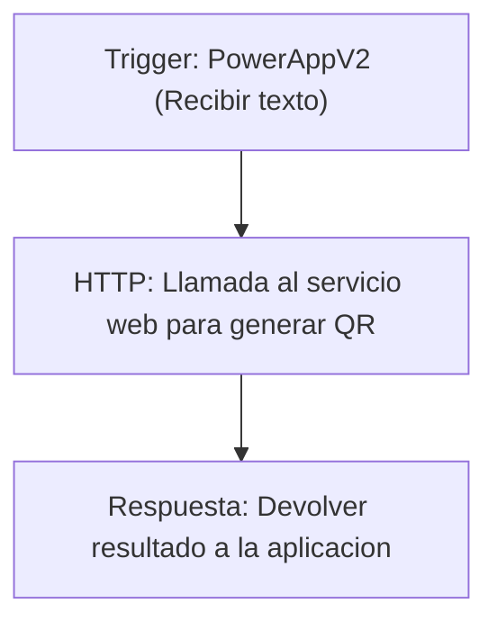

# Especificación Técnica de Arquitectura

## 1. Resumen Ejecutivo
La solución "QR Code Generator" es una aplicación diseñada para generar códigos QR a partir de texto proporcionado por los usuarios. Esta solución combina componentes de Microsoft Power Platform, como una aplicación Canvas y un flujo de Power Automate, para ofrecer una interfaz de usuario intuitiva y una lógica de backend que interactúa con un servicio web externo para generar los códigos QR.

El flujo de trabajo comienza con la entrada de texto en la aplicación Canvas, que luego se envía a un flujo de Power Automate. Este flujo se encarga de procesar la solicitud y realizar una llamada a un servicio web externo para generar el código QR correspondiente. Finalmente, el resultado se devuelve a la aplicación para su visualización. La solución está diseñada para ser utilizada en dispositivos tipo tablet y tiene como objetivo simplificar la creación de códigos QR para diferentes propósitos empresariales.

## 2. Inventario de Componentes
| Display Name       | Logical Name / Archivo                          | Tipo (Flow, Table, App, EnvVar) | Descripción / Propósito                                      |
|--------------------|------------------------------------------------|---------------------------------|-------------------------------------------------------------|
| QR Code Generator  | dbdtech_qrcodegenerator_442a3                  | App                             | Aplicación Canvas para capturar texto y mostrar el código QR generado. |
| QR Request         | QRRequest-5E86C0A8-C20C-EF11-9F89-000D3AD818A0 | Flow                            | Flujo de Power Automate que procesa la solicitud de generación de código QR. |
| Flujos lógicos     | 249ae0d1-504d-440b-8c74-ac51461c448c           | Connection Reference            | Referencia de conexión utilizada por el flujo "QR Request". |

## 3. Modelo de Datos (Dataverse)
No aplica.

## 4. Lógica de Procesos (Power Automate)
### Flujo: QR Request
Este flujo es activado manualmente desde la aplicación Canvas mediante un trigger de tipo `PowerAppV2`. El flujo recibe un texto como entrada, realiza una llamada HTTP a un servicio web externo para generar el código QR y devuelve el resultado a la aplicación.

#### Descripción de la lógica:
1. **Trigger**: `manual` (tipo `PowerAppV2`) - Recibe un texto como entrada desde la aplicación Canvas.
2. **Acción HTTP**: Realiza una solicitud GET al servicio web `https://dbdtech-qrgen.azurewebsites.net/api/src`, pasando el texto como parámetro de consulta.
3. **Respuesta**: Devuelve el resultado del servicio web a la aplicación Canvas, incluyendo el estado de la solicitud y el cuerpo de la respuesta.

#### Diagrama de flujo:

```mermaid
flowchart TD
    A["Trigger: PowerAppV2 (Recibir texto)"] --> B["HTTP: Llamada al servicio web para generar QR"]
    B --> C["Respuesta: Devolver resultado a la aplicacion"]
```

## 5. Interfaz de Usuario (Canvas / Model-Driven)
### Aplicación: QR Code Generator
La aplicación Canvas "QR Code Generator" está diseñada para dispositivos tipo tablet y tiene las siguientes características principales:
- **Pantalla principal**:
  - **TextInputCanvas1**: Campo de entrada de texto donde el usuario puede escribir el contenido que desea convertir en un código QR.
  - **ButtonCanvas1**: Botón que envía el texto ingresado al flujo de Power Automate "QR Request".
  - **Image1**: Imagen que muestra el código QR generado por el flujo.
  - **TextCanvas1**: Texto que muestra mensajes o resultados adicionales relacionados con la generación del código QR.

La interfaz está optimizada para ser utilizada en orientación tanto vertical como horizontal, y tiene un diseño limpio con un fondo azul claro (`RGBA(0,176,240,1)`).