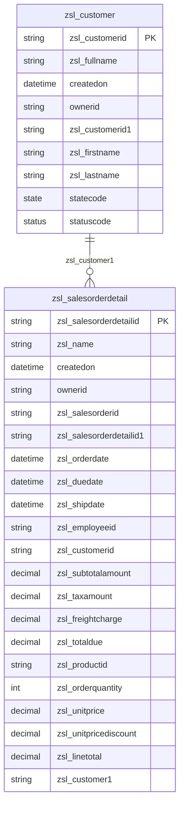
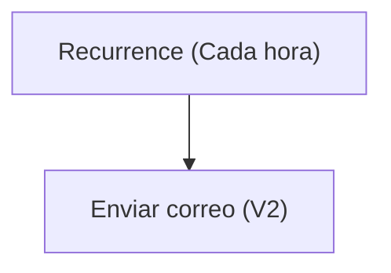

# Especificación Técnica de Arquitectura

## 1. Resumen Ejecutivo
La solución analizada está diseñada para gestionar información relacionada con clientes y detalles de órdenes de venta en un entorno de Microsoft Dataverse. Incluye componentes que permiten la gestión de datos de clientes y órdenes de venta, la automatización de procesos de notificación por correo electrónico y la creación de vistas y formularios para la interacción con los datos. 

El flujo de Power Automate incluido en la solución envía notificaciones por correo electrónico cada hora con una estampa de tiempo actual, lo que permite mantener a los usuarios informados de manera periódica. Además, la solución incluye dos tablas principales, `zsl_customer` y `zsl_salesorderdetail`, que están relacionadas entre sí y contienen información clave sobre los clientes y los detalles de las órdenes de venta, respectivamente. También se han definido múltiples formularios y vistas para facilitar la interacción con los datos.

## 2. Inventario de Componentes
| Display Name                     | Logical Name / Archivo                                     | Tipo (Flow, Table, App, EnvVar) | Descripción / Propósito                                                                 |
|----------------------------------|-----------------------------------------------------------|---------------------------------|-----------------------------------------------------------------------------------------|
| Notificación horario             | Notificacinhorario-2B44A048-0EB5-F111-AAAB-7C1E5287D75E.json | Flow                            | Flujo que envía un correo electrónico cada hora con una estampa de tiempo actual.       |
| Customer                         | zsl_customer                                              | Table                           | Tabla que contiene información sobre los clientes.                                      |
| Sales Order Detail               | zsl_salesorderdetail                                      | Table                           | Tabla que contiene detalles de las órdenes de venta.                                    |
| Office 365 Outlook TestSolution1 | zsl_sharedoffice365_ee2b8                                 | Connection Reference            | Referencia de conexión para enviar correos electrónicos a través de Office 365 Outlook. |

## 3. Modelo de Datos (Dataverse)

## 4. Lógica de Procesos (Power Automate)
### Flujo: Notificación horario
**Descripción:** Este flujo se ejecuta cada hora y envía un correo electrónico con una estampa de tiempo actual.

#### Triggers:
- **Recurrence:** Se ejecuta cada hora, comenzando desde el 20 de septiembre de 2026 a las 08:00 UTC.

#### Acciones:
1. **Enviar correo electrónico (V2):** Envía un correo electrónico a `juan.hincapie@zerostatelabs.dev` con el asunto y cuerpo que incluyen la estampa de tiempo actual.

#### Diagrama de flujo:

## 5. Interfaz de Usuario (Canvas / Model-Driven)
### Formularios:
1. **Información (zsl_customer):** Formulario principal para la entidad `zsl_customer` que incluye campos como `FullName`, `Propietario`, `CustomerID`, `FirstName` y `LastName`.
2. **Información (zsl_salesorderdetail):** Formulario principal para la entidad `zsl_salesorderdetail` que incluye campos como `Primary Column`, `Propietario`, `SalesOrderID`, `OrderDate`, `DueDate`, `ShipDate`, entre otros.

### Vistas:
1. **Vista asociada de Customer:** Muestra información básica de los clientes activos, como `zsl_fullname` y `createdon`.
2. **Customer activo:** Lista de clientes activos con atributos adicionales como `zsl_customerid1`, `zsl_firstname` y `zsl_lastname`.
3. **Vista de búsqueda avanzada de Customer:** Permite buscar clientes activos con filtros avanzados.
4. **Búsqueda rápida de Customer activos:** Proporciona una búsqueda rápida de clientes activos por nombre.
5. **Mis Customer:** Lista de clientes activos asignados al usuario actual.
6. **Customer inactivo:** Lista de clientes inactivos.

7. **Vista asociada de Sales Order Detail:** Muestra información básica de los detalles de órdenes de venta activas.
8. **Sales Order Detail activo:** Lista de detalles de órdenes de venta activas con atributos adicionales como `zsl_salesorderid`, `zsl_orderdate`, `zsl_totaldue`, entre otros.
9. **Vista de búsqueda avanzada de Sales Order Detail:** Permite buscar detalles de órdenes de venta activas con filtros avanzados.
10. **Búsqueda rápida de Sales Order Detail activos:** Proporciona una búsqueda rápida de detalles de órdenes de venta activos por nombre.
11. **Mis Sales Order Detail:** Lista de detalles de órdenes de venta activos asignados al usuario actual.
12. **Sales Order Detail inactivo:** Lista de detalles de órdenes de venta inactivos.

