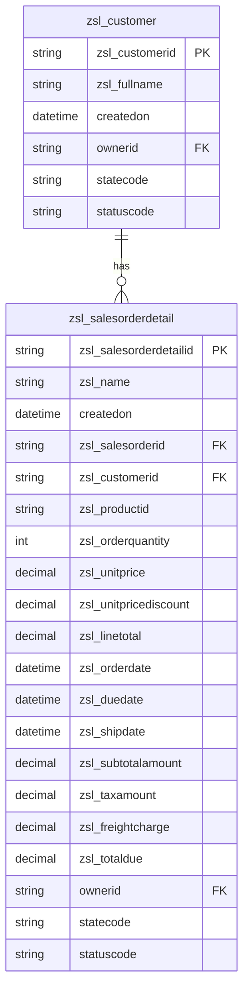
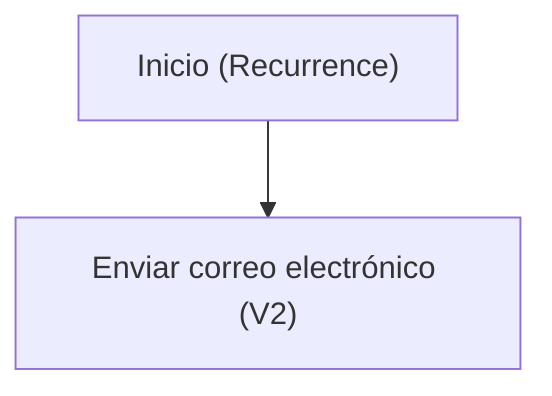

```markdown
# Especificación Técnica de Arquitectura

## 1. Resumen Ejecutivo
La solución analizada tiene como objetivo principal gestionar información relacionada con clientes y detalles de órdenes de venta en un entorno empresarial. Incluye componentes de datos, procesos automatizados y formularios para la interacción con los usuarios. La solución permite la creación, actualización y consulta de registros de clientes y órdenes de venta, así como la automatización de notificaciones periódicas mediante correos electrónicos.

Los componentes de la solución están diseñados para facilitar la gestión de datos de clientes y órdenes de venta, incluyendo relaciones entre entidades, vistas personalizadas y formularios para la interacción del usuario. Además, se incluye un flujo de Power Automate que envía notificaciones por correo electrónico de manera recurrente, lo que mejora la eficiencia operativa y la comunicación dentro de la organización.

## 2. Inventario de Componentes
| Display Name                     | Logical Name / Archivo                                     | Tipo (Flow, Table, App, EnvVar) | Descripción / Propósito                                      |
|----------------------------------|-----------------------------------------------------------|---------------------------------|-------------------------------------------------------------|
| Notificación horario             | Notificacinhorario-2B44A048-0EB5-F111-AAAB-7C1E5287D75E.json | Flow                            | Flujo que envía correos electrónicos recurrentes cada hora. |
| Customer                         | zsl_customer                                              | Table                           | Tabla que contiene información de clientes.                 |
| Sales Order Detail               | zsl_salesorderdetail                                      | Table                           | Tabla que contiene detalles de órdenes de venta.            |
| Office 365 Outlook TestSolution1 | zsl_sharedoffice365_ee2b8                                 | Connection Reference            | Conexión a Office 365 para el envío de correos electrónicos.|

## 3. Modelo de Datos (Dataverse)


## 4. Lógica de Procesos (Power Automate)
El flujo "Notificación horario" está configurado para ejecutarse de manera recurrente cada hora. Este flujo utiliza un disparador de tipo "Recurrence" que se activa cada hora a partir de una fecha y hora específica. Una vez activado, el flujo ejecuta una acción para enviar un correo electrónico utilizando la conexión de Office 365.

### Lógica del flujo


- **Trigger:** Recurrence - Se ejecuta cada hora a partir de "2026-09-20T08:00:00Z".
- **Acción:** Enviar correo electrónico (V2) - Envía un correo a "juan.hincapie@zerostatelabs.dev" con el asunto y cuerpo que incluyen la estampa de tiempo actual.

## 5. Interfaz de Usuario (Canvas / Model-Driven)
La solución incluye varios formularios asociados a las entidades `zsl_customer` y `zsl_salesorderdetail`. Estos formularios están diseñados para facilitar la interacción del usuario con los datos de las entidades.

### Formularios de la entidad `zsl_customer`:
1. **Formulario "Información" (ID: {087abbaf-5f1c-4ddc-9796-57a6dcf4d5eb}):**
   - Pantalla principal para gestionar información general del cliente, como nombre completo, propietario, y fecha de creación.

2. **Formulario "Customer activo" (ID: {121fc952-7a57-41b2-8d4d-9fe7deada275}):**
   - Vista personalizada para mostrar clientes activos con atributos como nombre completo, fecha de creación, y estado.

### Formularios de la entidad `zsl_salesorderdetail`:
1. **Formulario "Información" (ID: {0fc10cc2-49f9-4c8b-8b11-eb0e8841aa38}):**
   - Pantalla principal para gestionar detalles de órdenes de venta, incluyendo información como ID de la orden, cantidad de productos, precio unitario, y total de la línea.

2. **Formulario "Sales Order Detail activo" (ID: {4e706b9b-c7f7-4d91-bd06-fdbabfd8dcd6}):**
   - Vista personalizada para mostrar detalles de órdenes de venta activas con atributos como nombre, fecha de creación, y estado.

3. **Formulario "Sales Order Detail inactivo" (ID: {536f4dc9-0025-467a-9360-9012497fe190}):**
   - Vista personalizada para mostrar detalles de órdenes de venta inactivas.

4. **Formulario "Mis Sales Order Detail" (ID: {7520a356-c765-4d92-8f4b-c9a7d9277737}):**
   - Vista personalizada para mostrar detalles de órdenes de venta activas propiedad del usuario actual.

En general, los formularios están diseñados para proporcionar una experiencia de usuario intuitiva y eficiente en la gestión de datos de clientes y órdenes de venta.
```