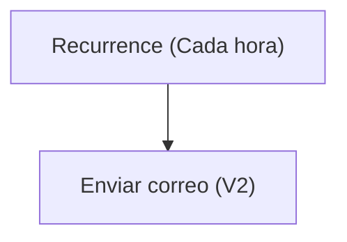

# Especificación Técnica de Arquitectura

## 1. Resumen Ejecutivo

La solución "TestSolution1" está diseñada para gestionar información relacionada con clientes y detalles de pedidos de ventas en una organización. Incluye una estructura de datos basada en Dataverse con entidades personalizadas como `zsl_customer` y `zsl_salesorderdetail`, que permiten almacenar y organizar información sobre clientes y detalles de pedidos. Además, la solución incorpora un flujo de Power Automate que envía notificaciones por correo electrónico de manera recurrente, proporcionando actualizaciones periódicas sobre el estado de las operaciones. También incluye formularios y vistas personalizadas para facilitar la interacción del usuario con los datos.

En conjunto, esta solución permite a los usuarios gestionar eficientemente la información de clientes y pedidos, automatizar notificaciones importantes y proporcionar interfaces de usuario personalizadas para mejorar la experiencia del usuario y la productividad.

## 2. Inventario de Componentes

| Display Name                  | Logical Name / Archivo                                   | Tipo (Flow, Table, App, EnvVar) | Descripción / Propósito                                      |
|-------------------------------|---------------------------------------------------------|---------------------------------|-------------------------------------------------------------|
| Notificación horario          | Notificacinhorario-2B44A048-0EB5-F111-AAAB-7C1E5287D75E | Flow                            | Flujo recurrente que envía notificaciones por correo electrónico. |
| Customer                      | zsl_customer                                           | Table                           | Tabla para gestionar información de clientes.               |
| Sales Order Detail            | zsl_salesorderdetail                                   | Table                           | Tabla para gestionar detalles de pedidos de ventas.         |
| Office 365 Outlook Connection | zsl_sharedoffice365_ee2b8                              | EnvVar                          | Conexión para enviar correos electrónicos mediante Office 365. |

## 3. Modelo de Datos (Dataverse)

```mermaid
erDiagram
    zsl_customer {
        zsl_customerid PK
        zsl_fullname
        createdon
        ownerid
    }
    zsl_salesorderdetail {
        zsl_salesorderdetailid PK
        createdon
        ownerid
    }
    zsl_customer ||--o{ zsl_salesorderdetail : "zsl_customer1"
    zsl_customer ||--o{ Owner : "ownerid"
    zsl_salesorderdetail ||--o{ Owner : "ownerid"
```

### Campos clave:
- **zsl_customer**:
  - `zsl_customerid`: Identificador único del cliente.
  - `zsl_fullname`: Nombre completo del cliente.
  - `createdon`: Fecha de creación del registro.
  - `ownerid`: Propietario del registro.

- **zsl_salesorderdetail**:
  - `zsl_salesorderdetailid`: Identificador único del detalle de pedido.
  - `createdon`: Fecha de creación del registro.
  - `ownerid`: Propietario del registro.

## 4. Lógica de Procesos (Power Automate)

### Flujo: Notificación horario
Este flujo se ejecuta de manera recurrente cada hora y envía un correo electrónico con la estampa de tiempo actual. Utiliza una conexión a Office 365 Outlook para enviar el correo.

#### Triggers y Acciones:
- **Trigger**: `Recurrence`
  - Frecuencia: Cada hora.
  - Hora de inicio: 2026-09-20T08:00:00Z.
- **Acción**: `Enviar correo electrónico (V2)`
  - Destinatario: juan.hincapie@zerostatelabs.dev.
  - Asunto: "Estampa de tiempo actual @{utcNow()}".
  - Cuerpo: "<p>Estampa de tiempo actual @{utcNow()}</p>".



## 5. Interfaz de Usuario (Canvas / Model-Driven)

### Formularios:
1. **Formulario: Información (zsl_customer)**
   - Pantalla principal para gestionar información de clientes.
   - Campos principales: `zsl_fullname`, `ownerid`, `createdon`.

2. **Formulario: Información (zsl_salesorderdetail)**
   - Pantalla principal para gestionar detalles de pedidos.
   - Campos principales: `zsl_salesorderdetailid`, `ownerid`, `createdon`.

### Vistas:
1. **Vista asociada de Customer**:
   - Muestra clientes asociados con columnas como `zsl_fullname` y `createdon`.

2. **Vista de búsqueda avanzada de Customer**:
   - Permite realizar búsquedas avanzadas de clientes activos.

3. **Búsqueda rápida de Customer activos**:
   - Proporciona una búsqueda rápida de clientes activos basada en el nombre completo.

4. **Mis Customer**:
   - Muestra los clientes activos que pertenecen al usuario actual.

5. **Customer inactivo**:
   - Lista de clientes inactivos.

6. **Vista de búsqueda de Customer**:
   - Vista predeterminada para buscar clientes.