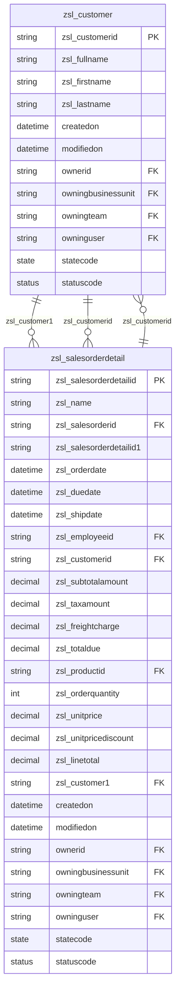
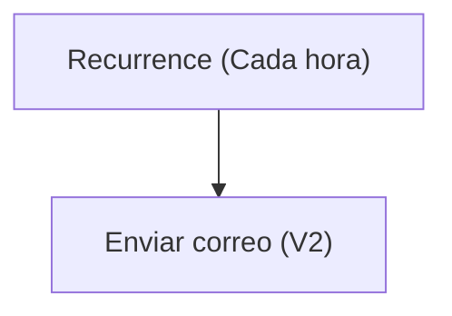

# Especificación Técnica de Arquitectura

## 1. Resumen Ejecutivo

La solución "TestSolution1" está diseñada para gestionar información relacionada con clientes y detalles de órdenes de venta en un entorno empresarial. La solución incluye dos tablas principales: `zsl_customer` para almacenar información de clientes y `zsl_salesorderdetail` para gestionar los detalles de las órdenes de venta. Además, la solución incluye un flujo automatizado en Power Automate llamado "Notificación horario", que envía notificaciones por correo electrónico en intervalos regulares.

La solución también incluye varias vistas y formularios para facilitar la gestión y visualización de los datos de las tablas mencionadas. Estas vistas y formularios están diseñados para proporcionar una experiencia de usuario optimizada, permitiendo a los usuarios interactuar con los datos de manera eficiente. En conjunto, la solución busca mejorar la gestión de clientes y órdenes de venta, así como automatizar notificaciones periódicas.

---

## 2. Inventario de Componentes

| Display Name               | Logical Name / Archivo                                      | Tipo (Flow, Table, App, EnvVar) | Descripción / Propósito                                          |
|----------------------------|------------------------------------------------------------|---------------------------------|------------------------------------------------------------------|
| Notificación horario       | Notificacinhorario-2B44A048-0EB5-F111-AAAB-7C1E5287D75E.json | Flow                            | Flujo que envía notificaciones por correo electrónico cada hora. |
| Customer                   | zsl_customer                                               | Table                           | Tabla que almacena información de clientes.                     |
| Sales Order Detail         | zsl_salesorderdetail                                       | Table                           | Tabla que almacena detalles de órdenes de venta.                |
| Office 365 Outlook         | zsl_sharedoffice365_ee2b8                                  | Connection Reference            | Conexión para enviar correos electrónicos a través de Office 365.|

---

## 3. Modelo de Datos (Dataverse)

---

## 4. Lógica de Procesos (Power Automate)

### Flujo: Notificación horario
**Descripción:** Este flujo se ejecuta cada hora y envía un correo electrónico con la estampa de tiempo actual al destinatario `juan.hincapie@zerostatelabs.dev`.

**Trigger:**
- **Recurrence:** Se ejecuta cada 1 hora, comenzando desde el 20 de septiembre de 2026 a las 08:00 UTC.

**Acciones:**
1. **Enviar correo electrónico (V2):** Envía un correo electrónico con los siguientes detalles:
   - Destinatario: `juan.hincapie@zerostatelabs.dev`
   - Asunto: "Estampa de tiempo actual @{utcNow()}"
   - Cuerpo: `
Estampa de tiempo actual @{utcNow()}
`
   - Importancia: Normal

---

## 5. Interfaz de Usuario (Canvas / Model-Driven)

### Formularios
1. **Formulario de Customer:**
   - **General:** Contiene campos como `FullName`, `Propietario`, `CustomerID`, `FirstName`, y `LastName`.
   - **Detalles:** Incluye información adicional como estado y razones del estado.

2. **Formulario de Sales Order Detail:**
   - **General:** Incluye campos como `Primary Column`, `Propietario`, `SalesOrderID`, `OrderDate`, `DueDate`, `ShipDate`, entre otros.
   - **Detalles:** Proporciona información detallada sobre los productos, cantidades y precios relacionados con las órdenes de venta.

### Vistas
1. **Customer activo:** Muestra clientes activos con campos como `FullName`, `CustomerID`, `FirstName`, y `LastName`.
2. **Sales Order Detail activo:** Muestra detalles de órdenes de venta activas con campos como `Name`, `OrderDate`, `DueDate`, y `TotalDue`.

---