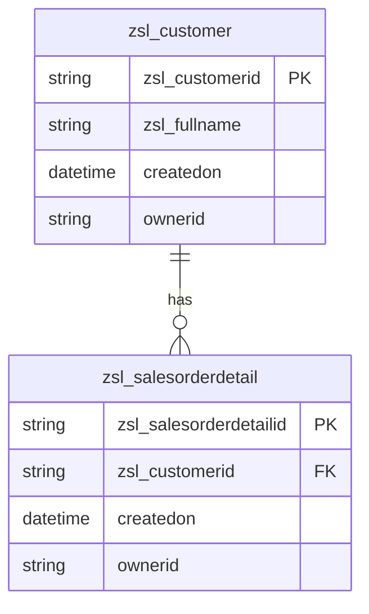
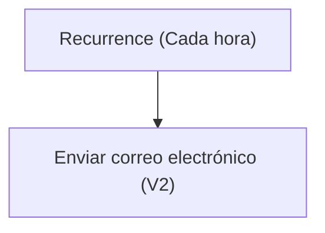

# Especificación Técnica de Arquitectura

## 1. Resumen Ejecutivo
La solución "TestSolution1" desarrollada por Zero State Labs tiene como objetivo principal gestionar información relacionada con clientes y detalles de pedidos de ventas en una organización. La solución incluye una combinación de componentes de Microsoft Power Platform, como flujos de Power Automate, tablas de Dataverse y formularios de aplicaciones basados en modelos. 

El flujo de trabajo principal, denominado "Notificación horario", se ejecuta de forma recurrente cada hora para enviar notificaciones por correo electrónico con información de marcas de tiempo actuales. Además, la solución incluye dos tablas principales: `zsl_customer` para gestionar información de clientes y `zsl_salesorderdetail` para registrar detalles de pedidos de ventas. Estas tablas están relacionadas entre sí y con otras entidades del sistema, como usuarios, equipos y unidades de negocio, lo que permite una gestión integral de los datos. La solución también incluye formularios y vistas personalizadas para facilitar la interacción con los datos y mejorar la experiencia del usuario.

## 2. Inventario de Componentes
| Display Name                | Logical Name / Archivo                                      | Tipo (Flow, Table, App, EnvVar) | Descripción / Propósito                                                                 |
|-----------------------------|------------------------------------------------------------|---------------------------------|-----------------------------------------------------------------------------------------|
| Notificación horario        | Notificacinhorario-2B44A048-0EB5-F111-AAAB-7C1E5287D75E.json | Flow                            | Flujo recurrente que envía notificaciones por correo electrónico cada hora.            |
| Customer                    | zsl_customer                                              | Table                           | Tabla que contiene información de clientes.                                            |
| Sales Order Detail          | zsl_salesorderdetail                                      | Table                           | Tabla que contiene detalles de pedidos de ventas.                                      |
| Office 365 Outlook          | zsl_sharedoffice365_ee2b8                                 | EnvVar                          | Conexión a Office 365 para enviar correos electrónicos.                                 |
| Información                 | {087abbaf-5f1c-4ddc-9796-57a6dcf4d5eb}.xml                | App                             | Formulario principal para la entidad `zsl_customer`.                                   |
| Información (Tarjeta)       | {c900099e-8cde-4965-81c8-c71bcc31d12b}.xml                | App                             | Formulario de tarjeta para la entidad `zsl_customer`.                                  |
| Información (General)       | {fa5c3d63-f919-4cc3-a66c-0c37cf31f1db}.xml                | App                             | Formulario adicional para la entidad `zsl_customer`.                                   |
| Vista asociada de Customer  | {01957b3c-7446-4c87-bca7-603e4919d381}.xml                | View                            | Vista predeterminada para la entidad `zsl_customer`.                                   |
| Customer activo             | {121fc952-7a57-41b2-8d4d-9fe7deada275}.xml                | View                            | Vista que muestra los clientes activos.                                                |
| Vista de búsqueda avanzada  | {96e7eb57-b78a-441e-9024-c2aa8aad19a6}.xml                | View                            | Vista para realizar búsquedas avanzadas en la entidad `zsl_customer`.                  |
| Búsqueda rápida de Customer | {820993a5-2425-4482-b2bd-b48268f55da0}.xml                | View                            | Vista de búsqueda rápida para clientes activos.                                        |
| Mis Customer                | {05415acf-ddef-4bff-9bc3-bfdd1469a2e9}.xml                | View                            | Vista que muestra los clientes activos propiedad del usuario actual.                   |
| Customer inactivo           | {e919030b-ecb3-4d3b-8f48-cdb165d9f1fb}.xml                | View                            | Vista que muestra los clientes inactivos.                                              |
| Vista de búsqueda de Customer | {b2889590-d8f3-45b3-a880-595b73002861}.xml              | View                            | Vista de búsqueda para la entidad `zsl_customer`.                                      |

## 3. Modelo de Datos (Dataverse)

## 4. Lógica de Procesos (Power Automate)
### Flujo: Notificación horario
**Descripción:** Este flujo se ejecuta cada hora para enviar un correo electrónico con la marca de tiempo actual.

**Trigger:**
- **Recurrence:** Se activa cada hora a partir del 20 de septiembre de 2026 a las 08:00 UTC.

**Acciones:**
1. **Enviar correo electrónico (V2):** Envía un correo electrónico a "juan.hincapie@zerostatelabs.dev" con el asunto y cuerpo que incluyen la marca de tiempo actual.

## 5. Interfaz de Usuario (Canvas / Model-Driven)
### Formularios
1. **Información:** Formulario principal para la entidad `zsl_customer`. Incluye campos como `FullName`, `Propietario`, `CustomerID`, `FirstName` y `LastName`.
2. **Información (Tarjeta):** Formulario de tarjeta para la entidad `zsl_customer`. Presenta un diseño compacto con campos clave como `FullName`, `Propietario` y `Fecha de creación`.
3. **Información (General):** Formulario adicional para la entidad `zsl_customer`. Contiene secciones como "GENERAL" y campos como `FullName` y `Propietario`.

### Vistas
1. **Vista asociada de Customer:** Muestra una lista de clientes con columnas como `zsl_fullname` y `createdon`.
2. **Customer activo:** Muestra clientes activos con detalles como `zsl_fullname`, `zsl_customerid1`, `zsl_firstname` y `zsl_lastname`.
3. **Vista de búsqueda avanzada de Customer:** Permite realizar búsquedas avanzadas en la entidad `zsl_customer`.
4. **Búsqueda rápida de Customer activos:** Proporciona una búsqueda rápida para clientes activos.
5. **Mis Customer:** Muestra los clientes activos propiedad del usuario actual.
6. **Customer inactivo:** Lista de clientes inactivos.
7. **Vista de búsqueda de Customer:** Vista de búsqueda para la entidad `zsl_customer`.