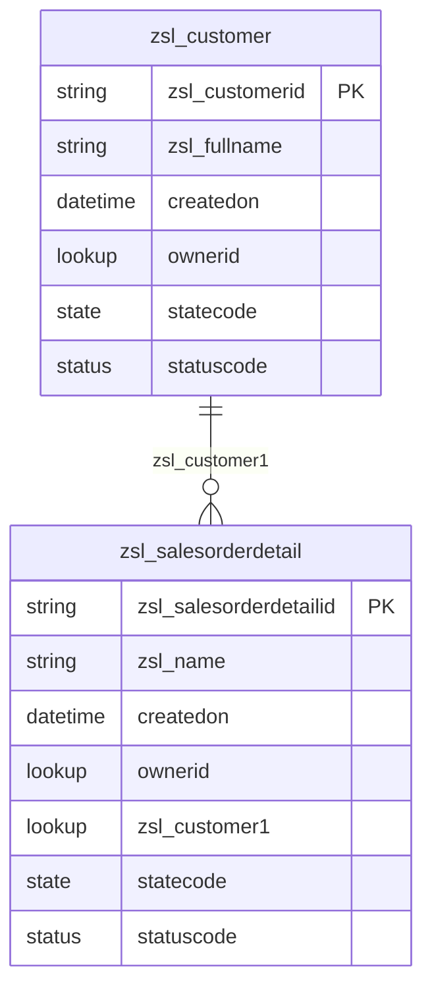
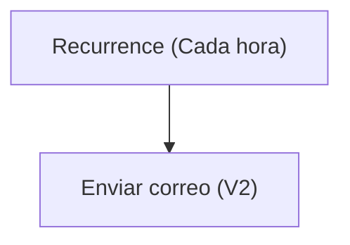

# Especificación Técnica de Arquitectura

## 1. Resumen Ejecutivo
La solución analizada tiene como objetivo principal gestionar información de clientes y detalles de órdenes de venta en una organización. Incluye una estructura de datos basada en Dataverse con tablas personalizadas para almacenar información de clientes y detalles de pedidos. Además, se han configurado relaciones entre estas tablas y otras entidades estándar de Dataverse, como usuarios, equipos y unidades de negocio, para garantizar una gestión adecuada de los datos.

La solución también incluye un flujo de Power Automate que envía notificaciones por correo electrónico cada hora con una estampa de tiempo actual. Este flujo está diseñado para automatizar la comunicación y garantizar que los usuarios reciban actualizaciones periódicas. Además, se han definido formularios y vistas para facilitar la interacción con los datos de las tablas personalizadas, proporcionando una interfaz de usuario amigable y funcional.

## 2. Inventario de Componentes
| Display Name                  | Logical Name / Archivo                                      | Tipo (Flow, Table, App, EnvVar) | Descripción / Propósito                                                                 |
|-------------------------------|------------------------------------------------------------|---------------------------------|---------------------------------------------------------------------------------------|
| Notificación horario          | Notificacinhorario-2B44A048-0EB5-F111-AAAB-7C1E5287D75E.json | Flow                            | Flujo que envía un correo electrónico cada hora con una estampa de tiempo actual.     |
| Customer                      | zsl_customer                                              | Table                           | Tabla personalizada para gestionar información de clientes.                          |
| Sales Order Detail            | zsl_salesorderdetail                                      | Table                           | Tabla personalizada para gestionar detalles de órdenes de venta.                     |
| Office 365 Outlook            | zsl_sharedoffice365_ee2b8                                 | Connection Reference            | Referencia de conexión para enviar correos electrónicos mediante Office 365 Outlook. |

## 3. Modelo de Datos (Dataverse)

## 4. Lógica de Procesos (Power Automate)
### Flujo: Notificación horario
**Descripción:** Este flujo se ejecuta cada hora y envía un correo electrónico con la estampa de tiempo actual a un destinatario específico.

**Trigger:**
- **Recurrence:** Se ejecuta cada hora, comenzando desde el 20 de septiembre de 2026 a las 08:00 UTC.

**Acciones:**
1. **Enviar correo electrónico (V2):** Utiliza la conexión de Office 365 Outlook para enviar un correo electrónico a "juan.hincapie@zerostatelabs.dev" con el asunto y cuerpo que incluyen la estampa de tiempo actual.

## 5. Interfaz de Usuario (Canvas / Model-Driven)
La solución incluye varios formularios y vistas para las tablas personalizadas `zsl_customer` y `zsl_salesorderdetail`. Estos formularios están diseñados para gestionar la información de clientes y detalles de órdenes de venta.

### Formularios:
1. **Customer - Información:** Formulario principal para gestionar la información de clientes, incluyendo campos como `FullName`, `Propietario`, `CustomerID`, entre otros.
2. **Sales Order Detail - Información:** Formulario principal para gestionar detalles de órdenes de venta, incluyendo campos como `Primary Column`, `Propietario`, `SalesOrderID`, `OrderDate`, `TotalDue`, entre otros.

### Vistas:
1. **Customer activo:** Muestra los clientes activos con atributos como `FullName`, `CustomerID`, `FirstName` y `LastName`.
2. **Sales Order Detail activo:** Muestra los detalles de órdenes de venta activas con atributos como `Name`, `SalesOrderID`, `OrderDate`, `TotalDue`, entre otros.

