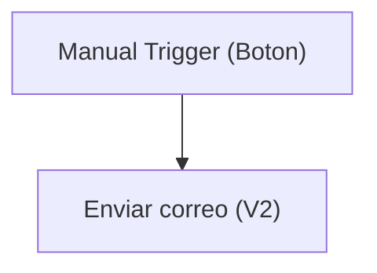

# Especificación Técnica de Arquitectura

## 1. Resumen Ejecutivo
La solución analizada, denominada "TestSolution2", tiene como objetivo principal implementar un flujo de aprobaciones automatizado utilizando Microsoft Power Automate. Este flujo permite enviar correos electrónicos de notificación a destinatarios específicos, facilitando la comunicación y la gestión de aprobaciones dentro de la organización. 

El flujo utiliza una conexión a Office 365 para enviar correos electrónicos y está diseñado para ser activado manualmente mediante un botón. La solución no incluye tablas ni aplicaciones de usuario, centrándose exclusivamente en la automatización de procesos mediante Power Automate.

## 2. Inventario de Componentes
| Display Name         | Logical Name / Archivo                                   | Tipo (Flow, Table, App, EnvVar) | Descripción / Propósito                                   |
|----------------------|---------------------------------------------------------|---------------------------------|----------------------------------------------------------|
| Flujo de aprobaciones | Flujodeaprobaciones-25D47082-BDBE-F111-AAAF-7C1E5287D75E.json | Flow                            | Flujo que envía correos electrónicos de notificación.    |
| zsl_sharedoffice365_ee2b8 | zsl_sharedoffice365_ee2b8                             | Connection Reference            | Referencia de conexión a Office 365 para enviar correos. |

## 3. Modelo de Datos (Dataverse)
No aplica.

## 4. Lógica de Procesos (Power Automate)
El flujo "Flujo de aprobaciones" está diseñado para ser activado manualmente mediante un botón. Una vez activado, ejecuta una acción para enviar un correo electrónico utilizando la conexión a Office 365. El correo incluye un destinatario específico, un asunto, un cuerpo en formato HTML y una prioridad normal.

### Diagrama de Lógica

- **Trigger**: Manual (tipo botón).
- **Acción**: Enviar un correo electrónico utilizando la conexión `zsl_sharedoffice365_ee2b8`.

## 5. Interfaz de Usuario (Canvas / Model-Driven)
No aplica.